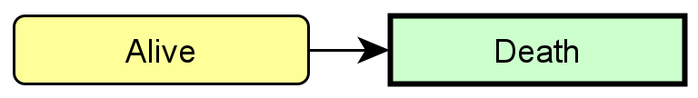
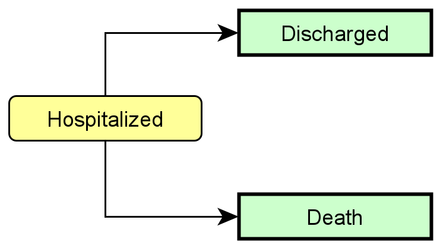
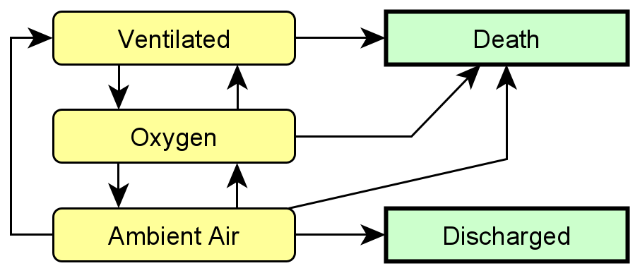
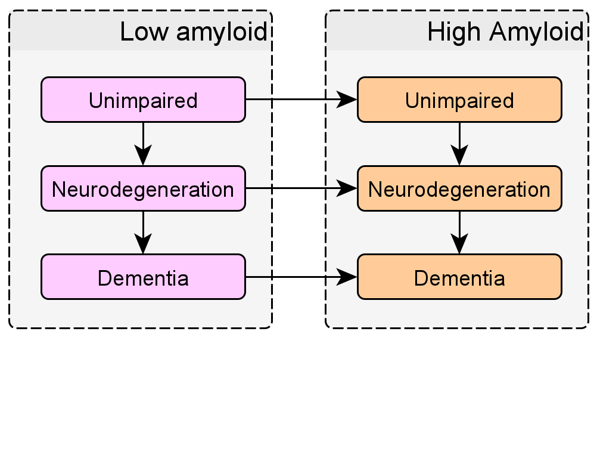
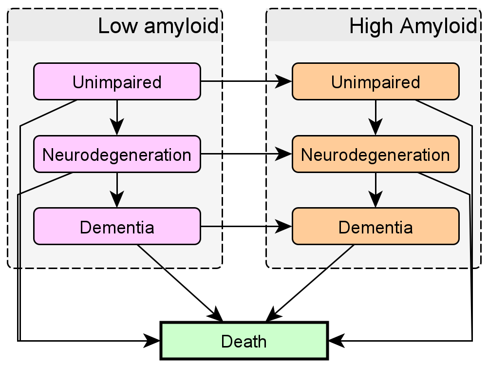
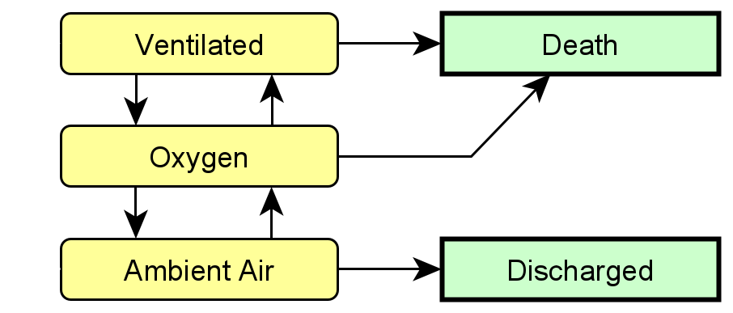
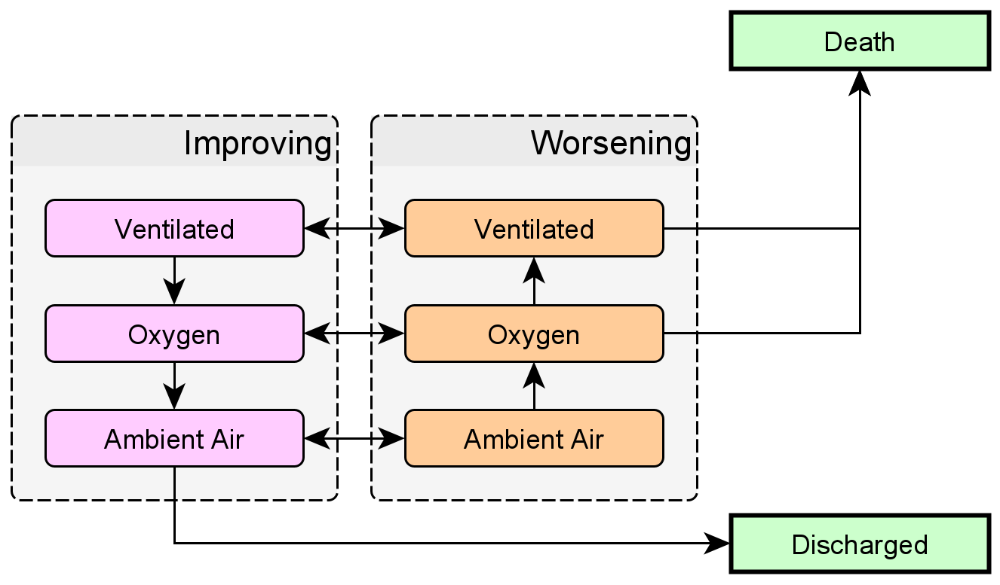
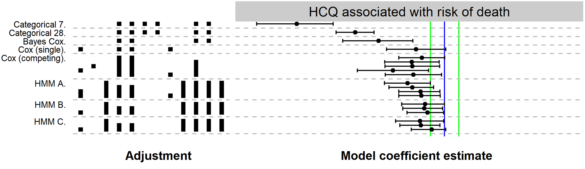

# Disease progression models

--

--

---

# Disease progression models III

Covid-19 Diseaese progression + treatments, Modrák et al. 2021, https://doi.org/10.1371/journal.pone.0245103

---

# Disease progression models IV

Mayo Clinic Study of Aging (MCSA) - dementia progression. 
As analyzed by Williams et al. 2018, https://doi.org/10.1080/01621459.2019.1594831

---

# Disease progression models IV

---

# How to fit progression models?

--

- Cox proportional hazards

--

- Accelerated failure time

--

- (Hidden) Markov Models

???

Will just briefly mention accelerated failure time

---

# What Cox PH cannot (easily) do

- Impose structure on states

--

$P(X_{t} = \mathtt{Ventilated} | X_{t - 1} = \mathtt{Oxygen}) > \\ > P(X_{t} = \mathtt{Ventilated} | X_{t - 1} = \mathtt{AA})$

--

- No structure $\rightarrow$ not many transitions

--

- Missing/Partially observed states

???

Not an expert happy to be corrected

Extrapolation not important and hard anyway

Dementia diagnosed only at doctor visit -> implied event "Visited doctor and got dementia"

---

# Markov Models

Markov property:

$P(X_t = k | X_{t-1}, ..., X_0) = P(X_t = k | X_{t-1})$

--

I.e. we need:

- A distribution of initial states $P(X_0)$

--

- Transition matrix $A$

---

# Markov Models - Observations

- The baseline risk is constant.

--

- Geometric distribution of sojourn times $^{(*)}$.

--

**Extension:** Transition matrix $A_t$ can differ in time/between patients   
--
(i.e. as a function of covariates)

---

# Hidden Markov Models

- $X_t$ not observed directly

--

- An arbitrary distribution $P(Y_t | X_t, \theta)$ can be used.

--

- **Forward algorithm**: Exact likelihood $P(Y_t, ... Y_1 | \theta)$ can be computed efficiently
  
--

  - Transition matrices can vary

--

  - Missing observations? No problem!

--

- Cannot have missing predictors

---

# Varying transition matrices

--

- $K$ categorical regressions

--

- $K$ ordinal regressions

--

- Rate matrix

---

# Rate matrix

Why do we observe transitions like $\mathtt{Ambient Air} \rightarrow \mathtt{Ventilated}$?

--

Two transitions in one day?

--

---

# Rate matrix II

$\frac{dP(X_t = \mathtt{AA})}{dt} = R_{\mathtt{Oxygen \rightarrow AA}} P(X_t = \mathtt{Oxygen}) - \\ - P(X_t = \mathtt{AA}) (R_{\mathtt{AA \rightarrow Oxygen}} + R_{\mathtt{AA \rightarrow Discharged}})$

---

# Rate Matrix III

- $i \neq j$ $R_{i,j}$ is the rate of transition from $i$ to $j$

--

- $R_{i,i} = -\sum_{j \neq i} R_{i,j}$. 

--

- $R$ sparse

--

This forms an ODE:

$\frac{dp(t)}{dt} = Rp$

--

Given  $p(0)$, we have:

$p(t) = \exp(tR)p(0)$

---

# Rate Matrix IV

$p(t) = \exp(tR)p(0)$

--

We now have $A = \exp(R)$ so that $p(t + 1) = Ap(t)$

--

- $A$ is _not_ sparse

--

- Predictors on $\log(R_{ij})$

--

- Still discrete time for predictors

--

- Matrix $\exp$ _very_ expensive

---

# Rates allow complex models

.smaller[

]

--

- 18 transitions, 13 rates

???
Low am: 6 + 4 + 2
High am: 3 + 2 + 1
-> 18 transitions

6 + 2 + 3 + 2 = 13 rates

---

# Rates allow complex models II

--

- 42 transitions, 13 rates

---

# Is it useful?

Hopefully, but I am not certain.

--

--

Additional assumptions $\leftrightarrow$ richer models

---

# Where is the code?

Using `brms`

--

- https://discourse.mc-stan.org/t/fitting-hmms-with-time-varying-transition-matrices-using-brms-a-prototype/19645

- https://github.com/cas-bioinf/covid19retrospective/  (`manuscript/hmm.Rmd`)

--

I need a push to develop this into something more broadly useful.
